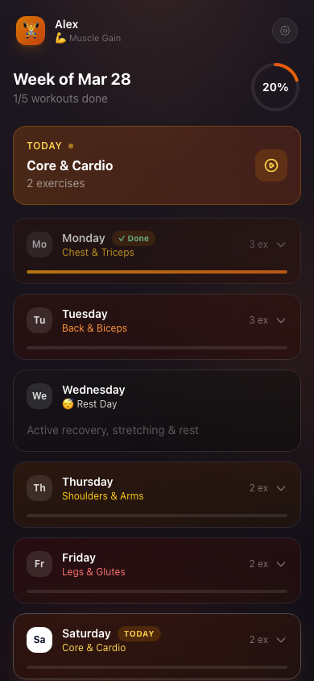

# Gym Buddy AI

Repo: `gym-budy-claude` (the repo name is misspelled; the clone URL below matches it)

A browser-only gym app that asks Google Gemini for a 7-day workout plan, then lets you tick off sets and reps as you train. For one person on one device — there are no accounts and no server.



More screens: [onboarding](public/screenshots/01-onboarding.png), [workout tracker](public/screenshots/04-workout-tracker.png), [progress](public/screenshots/05-progress.png), [AI coach](public/screenshots/06-ai-coach.png).

## Requirements

- Node 18 or newer (required by Vite 5)
- A Google Gemini API key from [Google AI Studio](https://aistudio.google.com/app/apikey) — without it, plan generation and the coach chat both fail
- A modern browser with `localStorage` enabled; that is the only place your data is stored

## Run it

```bash
git clone https://github.com/nvkudva/gym-budy-claude.git
cd gym-budy-claude
npm install
cp .env.local.example .env.local    # then fill in the variable below
npm run dev
```

Open http://localhost:5173 — a working setup shows the onboarding form asking for your age, weight and goal.

## Configuration

| Variable | Required | What it is |
|---|---|---|
| `VITE_GEMINI_API_KEY` | Yes | Google AI Studio key. Used for plan generation and the coach chat, both against `gemini-2.5-flash`. Vite inlines `VITE_`-prefixed variables into the client bundle, so anyone who loads a deployed build can read this key. |
| `VITE_ANTHROPIC_API_KEY` | No | Read by `src/services/anthropic.ts`, which nothing in the app imports. Leave it unset. |

## How it works

`src/services/` is the only place that talks to the model: `gemini.ts` holds the SDK client, `planGenerator.ts` turns a profile into a prompt and parses the JSON back into a plan, `chatService.ts` runs the coach conversation. All shared state lives in one React context, `src/context/AppContext.tsx`, which reads and writes five `localStorage` keys directly — profile, plan, chat messages, progress history and personal records. `src/App.tsx` shows onboarding until a profile exists, then four tabs from `src/components/` (plan, tracker, progress, chat). There is no router, no backend and no database. `src/data/exercises.ts` is a static exercise list used to seed prompts.

## Scripts

| Command | What it does |
|---|---|
| `npm run dev` | Vite dev server on port 5173 |
| `npm run build` | Type-check then production build |
| `npm run preview` | Serve the built bundle |
| `npm test` | Run the Vitest suite once |

## Status

Working: onboarding, plan generation, the workout tracker, the progress view and the coach chat, all against a live Gemini key.

Known problems, as of the code review on 2026-09-07 in [REVIEW.md](REVIEW.md):

- A live-format Google API key is committed in `.claude/settings.local.json`. Treat it as compromised and rotate it.
- The Gemini key is shipped to the browser in any deployed build. This design has no safe hosting story without a server-side proxy; run it locally.
- `npm run lint` cannot succeed — the script calls `eslint` but eslint is not a dependency and there is no config.
- Automated tests cover only the JSON extraction helper in `planGenerator.ts`. Nothing covers the context, the services or any component. The integration tests skip unless `VITE_GEMINI_API_KEY` is exported in the shell, because `vite.config.ts` fails to load `.env.local`.
- Model output is not validated before use. A malformed response throws rather than showing an error.
- No offline support: no service worker and no manifest, despite gyms with poor signal being the obvious use case.
- No data export, no schema versioning and no migrations. Clearing site data deletes all history.

Not built: accounts, sync between devices, a server, and any test of the tracker or chat UI.

## License

No licence file yet — all rights reserved.
